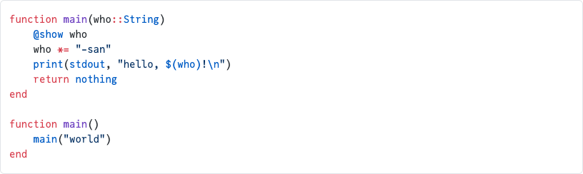

# Gallery

This page showcases practical examples of DocumenterShiki's syntax highlighting features in action.

## Shiki vs Highlight.js Quality Comparison

DocumenterShiki uses Shiki for syntax highlighting, which provides VS Code-quality highlighting with TextMate grammars.

### Before: highlight.js (Documenter.jl default)


*Traditional highlight.js highlighting - basic color coding with limited grammar recognition*

### After: Shiki (DocumenterShiki)



*Shiki highlighting - VS Code-quality with TextMate grammars*

The same code example shown above:

```nohighlight
function main(who::String)
    @show who
    who *= "-san"
    print(stdout, "hello, $(who)!\n")
    return nothing
end

function main()
    main("world")
end
```

### What makes Shiki better:

- **Operators**: Individual operators like `*=` and `::` are recognized and highlighted
- **Function calls**: Functions like `print` are highlighted differently from keywords
- **Type annotations**: `::String` gets proper syntax highlighting for types
- **Function and variable names**: Function names like `main` and variables like `who` are properly distinguished
- **String literals**: Quote marks and content are properly distinguished, escape sequences (`\n`) highlighted
- **String interpolation**: `$(who)` within strings are recognized

## Basic Examples

### Using `@example` Blocks

Simple code highlighting with Documenter's `@example` blocks:

```@example
a = 1
b = 2
a + b
```

### Using `@repl` Blocks

REPL-style interaction with Julia code using `@repl` blocks:

```@repl
x = [1, 2, 3, 4, 5]
sum(x)
mean_x = sum(x) / length(x)
```

### Using Standard Markdown Code Blocks

Standard markdown code blocks with language specifier also get Shiki highlighting:

```julia
function fibonacci(n)
    if n <= 1
        return n
    end
    return fibonacci(n-1) + fibonacci(n-2)
end

# Calculate the 10th Fibonacci number
result = fibonacci(10)
println("The 10th Fibonacci number is: ", result)
```

Note: Standard markdown code blocks show syntax highlighting but don't execute the code.

## Line Range Syntax Examples

Highlight specific lines using `@highlight:` comment at the beginning of the code block.

### Example: Circle Area Calculation

```@example
# @highlight: 2,4-5
function calculate_area(radius)
    π = 3.14159
    area = π * radius^2
    println("Radius: ", radius)
    println("Area: ", area)
    return area
end

calculate_area(5.0)
```

In this example:
- Line 2: The π constant definition is highlighted
- Lines 4-5: The output statements are highlighted
- This helps readers focus on the important calculation and output

## Block Syntax Examples

Highlight continuous blocks using `@highlight-start` and `@highlight-end`.

### Example: Data Validation

```@example
function process_data(data)
    println("Starting data processing...")

    # @highlight-start
    # Data validation
    if isempty(data)
        error("Data cannot be empty")
    end
    # @highlight-end
    # Process data
    result = map(x -> x * 2, data)
    println("Processing complete!")
    return result
end

# Test
test_data = [1, 2, 3, 4, 5]
result = process_data(test_data)
println("Result: ", result)
```

The highlighted block shows the data validation section, making it easy to identify error checking logic.

## Leveled Highlights Examples

Use different highlight levels (1-4) to visualize nested code structures with different colors.

### Example: Matrix Multiplication

```@example
# Matrix multiplication example
# @highlight-start[1]
function matrix_multiply(A, B)
    m, n = size(A)
    n2, p = size(B)

    # @highlight-start[2]
    # Check dimensions
    if n != n2
        error("Incompatible dimensions")
    end  # @highlight-end

    C = zeros(m, p)
    # @highlight-start[3]
    for i in 1:m
        # @highlight-start[4]
        for j in 1:p
            for k in 1:n
                C[i,j] += A[i,k] * B[k,j]
            end
        end # @highlight-end
    end # @highlight-end

    return C
end # @highlight-end

# Test
A = [1 2; 3 4]
B = [5 6; 7 8]
C = matrix_multiply(A, B)
println("Result:\n", C)
```

Highlight levels:
- **Level 1 (Yellow)**: The entire function
- **Level 2 (Red)**: Dimension validation
- **Level 3 (Green)**: Outer loop
- **Level 4 (Blue)**: Inner loop

This makes the nested structure immediately visible.

## Inline Comment Syntax Examples

Highlight specific lines using `[!code highlight]` in comments.

### Example: Fibonacci Sequence

```@example
# Calculate fibonacci number
function fibonacci(n)
    if n <= 1
        return n
    end
    a, b = 0, 1
    for i in 2:n
        a, b = b, a + b  # [!code highlight]
    end
    return b
end

result = fibonacci(10)  # [!code highlight]
println("10th Fibonacci number: ", result)
```

### Example: Multiple Lines

You can highlight multiple consecutive lines:

```@example
# Simple calculator
function calculator(a, b, operation)
    if operation == "+"
        return a + b  # [!code highlight:4]
    elseif operation == "-"
        return a - b
    elseif operation == "*"
        return a * b
    elseif operation == "/"
        return a / b
    else
        error("Unknown operation")
    end
end

result = calculator(10, 5, "+")
println("Result: ", result)
```

## Plot Examples

DocumenterShiki works seamlessly with Plots.jl:

```@example plots
using Plots

# Data generation
x = 0:0.1:2π
y = sin.(x)

# Create plot
# @highlight-start
p = plot(x, y,
    label="sin(x)",
    title="Sine and Cosine Waves",
    xlabel="x",
    ylabel="y",
    lw=2,
    color=:blue
)
# @highlight-end

# Add cosine wave
plot!(x, cos.(x),
    label="cos(x)",
    lw=2,
    color=:red
)
```

The highlighted section shows the main plot creation, helping readers distinguish it from the additional plot overlay.

## Complex Nested Example

Combining multiple highlighting techniques:

```@example
# Complex nested example
function process_matrix(data)
    # @highlight-start[1]
    println("Starting matrix processing")

    # @highlight-start[2]
    # Preprocessing
    filtered = filter(x -> x > 0, data) # @highlight-end

    # @highlight-start[3]
    # Main processing
    result = map(filtered) do x
        # @highlight-start[4]
        if x % 2 == 0
            x * 2
        else
            x * 3
        end # @highlight-end
    end # @highlight-end

    println("Processing complete") # @highlight-end
    return result
end

# Test execution
test_data = [-1, 2, 3, 4, 5]
result = process_matrix(test_data)
println("Result: ", result)
```

This example demonstrates:
- Level 1: Entire function scope
- Level 2: Preprocessing step
- Level 3: Main processing loop
- Level 4: Conditional logic inside the loop
